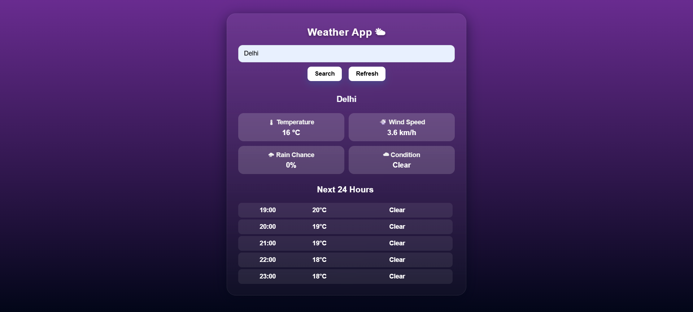

 🌦 Weather Web App
A responsive and user-friendly Weather Web Application built using **HTML, CSS, and JavaScript**, which fetches real-time weather data using the **Visual Crossing Weather API**.

# 🔥 Features
- 🌍 Search weather by city name
- 📍 Detects user's current location using Geolocation API
- 🌡 Displays temperature, wind speed, rain probability, and weather conditions
- ⏱ Shows next 24 hours weather forecast
- 🔄 Refresh weather data
- 🎨 Clean and modern UI with card-style layout
  
# 🛠 Tech Stack
- **Frontend:** HTML, CSS, JavaScript
- **API:** Visual Crossing Weather API
- **Tools:** VS Code, GitHub

# 📸 Screenshots


# 🚀 How to Run Locally
1. Clone the repository:
   ```bash
   git clone https://github.com/your-username/weather-web-app.git
2. Open Project Folder:
   cd weather-web-app
3. Open index.html in your browser
   OR use Live Server in VS Code. 

# API Configuration
Get a free API key from:
👉 https://www.visualcrossing.com/weather-api
Replace the API key in script.js:
   const API_KEY = "YOUR_API_KEY_HERE";
